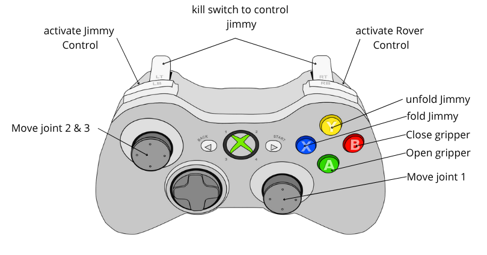

# PT_Rover

Simple teleoperation and project archives for the PT Rover.

Tested with ROS 2 Humble on Ubuntu 22.04 (Jammy Jellyfish).

---

## Table of contents

- [Prerequisites](#prerequisites)
- [Installation](#installation)
- [Build & Run](#build--run)
- [Monitoring & Debugging](#monitoring--debugging)
- [Robotic Arm ("Jimmy")](#robotic-arm-jimmy)


---

## Prerequisites

- Operating system: Ubuntu (tested on Ubuntu 22.04.5 LTS).
- ROS 2: Humble Hawksbill (matching Ubuntu 22.04).

Notes:
- ROS 2 is not supported on Raspbian. Other distros (e.g. Linux Mint) may lead to dependency issues.
- If running on a Raspberry Pi, use the Raspberry Pi Imager to flash Ubuntu, and consider a lightweight desktop (XFCE/LXQt) for better UI responsiveness.

Helpful links:
- ROS 2 Humble installation (Debs): https://docs.ros.org/en/humble/Installation/Ubuntu-Install-Debs.html
- Raspberry Pi Imager: https://www.raspberrypi.com/software/

---

## Installation

1. Install Ubuntu (if needed) and update packages:


2. Install ROS 2 Humble following the official instructions linked above. After installation, either open a new terminal or source the ROS environment:

```bash
source /opt/ros/humble/setup.bash
```

3. Flash the Arduino firmware for your rover.

---

## Build & Run

Option 1 — Using the provided launch file (recommended)

```bash
cd ~/PT_Rover    # change to your workspace root where `src/` is located
colcon build --packages-select teleop
source install/setup.bash
ros2 launch teleop teleop_launch.py
```

This should start the teleoperation stack for the rover.

Option 2 — Start components manually

```bash
cd ~/your_ros2_workspace
source /opt/ros/$ROS_DISTRO/setup.bash
colcon build
source install/setup.bash

# Run the teleop node (example)
ros2 run teleop rover

# In another terminal (for joystick control)
source /opt/ros/$ROS_DISTRO/setup.bash
source install/setup.bash
ros2 launch teleop_twist_joy teleop-launch.py
```

Notes:
- Replace `~/your_ros2_workspace` with the path to your actual workspace.
- If you use a different ROS distro, replace `humble` or `$ROS_DISTRO` accordingly.

---

## Monitoring & Debugging

List topics:

```bash
ros2 topic list
```

Inspect topic messages (for example joystick input):

```bash
ros2 topic echo /joy
ros2 topic echo /cmd_vel
```

If you see `/joy` messages but no `/cmd_vel`, check:
- teleop node configuration and mappings
- joystick safety/enable button (some configurations require holding a stick/button to enable motion)

Refer to teleop_twist_joy for joystick configuration details: https://github.com/ros-teleop/teleop_twist_joy

---

## Robotic Arm ("Jimmy")

The robotic arm is called Jimmy. The control mapping image is included below:



If the image does not display in your environment, open `Documents/arm_control.png` in an image viewer.

---


