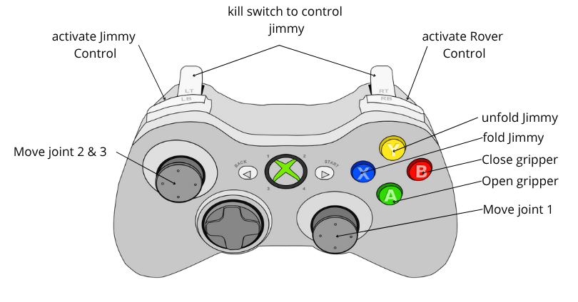

# PT_Rover

Simple teleoperation and project archives for the PT Rover. you can first go through Rover101.md for a System overview. 

Tested with ROS 2 Humble on Ubuntu 22.04 (Jammy Jellyfish).

If you want to explore further, everything that was originally on the rover at the end of the PT is stored in the **Archive** folder.  
You can also check out <https://github.com/G0sthlem11/rover>, which contains some of the work related to autonomous navigation (though parts of it may be incomplete).


---

## Table of contents

- [Prerequisites](#prerequisites)
- [Installation](#installation)
- [Build & Run](#build--run)
- [Monitoring & Debugging](#monitoring--debugging)
- [Robotic Arm ("Jimmy")](#robotic-arm-jimmy)


---

## Prerequisites

- Operating system: Ubuntu (tested on Ubuntu 22.04.5 LTS).
- ROS 2: Humble Hawksbill (matching Ubuntu 22.04).

Notes:
- ROS 2 is not supported on Raspbian. Other distros (e.g. Linux Mint) may lead to dependency issues.
- If running on a Raspberry Pi, use the Raspberry Pi Imager to flash Ubuntu, and consider a lightweight desktop (XFCE/LXQt) for better UI responsiveness.

Helpful links:
- ROS 2 Humble installation (Debs): https://docs.ros.org/en/humble/Installation/Ubuntu-Install-Debs.html
- Raspberry Pi Imager: https://www.raspberrypi.com/software/

---

## Installation

1. Install Ubuntu (if needed) and update packages, you will needed it both on the raspberry Pi and on a control computer.


2. Install ROS 2 Humble following the official instructions linked above. After installation, either open a new terminal or source the ROS environment:

```bash
source /opt/ros/humble/setup.bash
```

3. Flash the Arduino firmware for your rover.

Prerequisites are:
- Arduino is installed on the Raspberry Pi
- Check if the port used for USB communication between Arduino and Pi is `ttyACM0` or another
- Give the read/write rights to the port 

Use a terminal from your PC to access the raspberry Pi via ssh, example:

```bash
ssh rover@192.168.8.111
```

Upload arduino code from the Raspberry Pi to the Arduino

```bash
cd ~/PT_Rover/Arduino/full_control
arduino --upload full_control.ino --port /dev/ttyACM0`
```


---

## Build & Run

### 1. On the Raspberry Pi (Rover)

You can initially connect a screen and keyboard to the Raspberry Pi to perform the setup.  
However, during normal operation you will later need to access the Pi via SSH from another Linux computer, with the Arduino connected directly to the Raspberry Pi.


Clone the repository on the Raspberry Pi:

```bash
git clone https://github.com/42Hugo/PT_Rover.git
cd PT_Rover
```
Build the workspace:

```bash
source /opt/ros/$ROS_DISTRO/setup.bash
colcon build
source install/setup.bash
```

Run the rover node (ensure the Arduino is connected via USB).  
You can also test the code without an Arduino by temporarily commenting out the Arduino-related lines in `src/teleop/rover.py`.

To start the teleoperation node:

```bash
ros2 run teleop rover
```

### On the controll computer 

You do not need this repository on the control computer — only ROS2 and a connected gamepad.

Start the teleop_twist_joy node:

```bash
source /opt/ros/$ROS_DISTRO/setup.bash
ros2 launch teleop_twist_joy teleop-launch.py 
```

Check that joystick input is being published in new terminal:
```bash
source /opt/ros/$ROS_DISTRO/setup.bash
ros2 topic list
```

You should see /joy and /cmd_vel.

To inspect raw controller data (which button is being pressed):
```bash
ros2 topic echo /joy
```

To control the rover, you must press an *enable* button on the gamepad for the driving commands to publish.  
See the **Monitoring and Debugging** section to determine which button acts as the enable switch,  
and refer to the **Robotic Arm** section for details on controlling the arm.

## Monitoring & Debugging

List topics:

```bash
ros2 topic list
```

Inspect topic messages (for example joystick input):

```bash
ros2 topic echo /joy
ros2 topic echo /cmd_vel
```


To find the enable button required to drive the rover:  
If you can see `/joy` messages but not `/cmd_vel`, or if the rover does not move, check the points below.  
Once the correct enable button is pressed, driving the rover is done using the **left joystick**.


- **Teleop configuration and button mappings**  
    `teleop_twist_joy` often requires an *enable* button to be held before it publishes `/cmd_vel`.  
    Depending on the controller and configuration, this enable button can vary (e.g., `X`, `Y`, or pressing down a joystick).  

    To move the robotic arm, only the kill switch (see *Robotic Arm* section) is required.  
    However, to move the rover, `/cmd_vel` must be publishing, which means you must hold the correct enable button on the controller.


- **Verify `/joy` is receiving input**  
  First confirm that `/joy` is updating correctly:
  ```bash
  ros2 topic echo /joy
```

* **Check which button enables `/cmd_vel`**
  After confirming `/joy` works, echo `/cmd_vel` and test different buttons:

  ```bash
  ros2 topic echo /cmd_vel
  ```

  Note:

  * When explicitly using the Xbox config, the enable button *seemed to be `X`*.
  * With no controller type specified, the enable button was *pressing down the right joystick*.

To force the Xbox controller mapping, you can run:

```bash
ros2 launch teleop_twist_joy teleop-launch.py joy_config:='xbox'
```

Refer to the official teleop_twist_joy documentation for details on joystick configuration:
[https://github.com/ros-teleop/teleop_twist_joy](https://github.com/ros-teleop/teleop_twist_joy)


---

## Robotic Arm ("Jimmy")

The robotic arm is called Jimmy. The control mapping image is included below:



If the image does not display in your environment, open `Documents/arm_control.png` in an image viewer.

---


